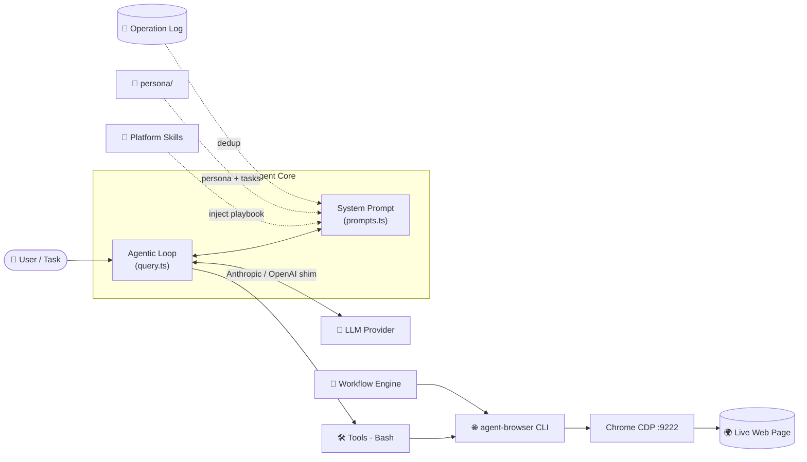

<p align="center">
  
</p>

<p align="center">
  <b>English</b> &nbsp;|&nbsp; <a href="README.zh-CN.md">简体中文</a>
</p>

<p align="center">
  <em>🤖 An AI agent that autonomously operates social media through a <b>real</b> browser.</em>
</p>

<p align="center">
  <a href="https://youtu.be/QesPS8xPaDA"></a>
  <a href="#-installation"></a>
  <a href="#-installation"></a>
  <a href="#-model-providers"></a>
  <a href="#-browser-automation"></a>
  
  <a href="LICENSE"></a>
</p>

---

## 📑 Table of Contents

- [✨ What is LocoAgent?](#-what-is-locoagent)
- [🏗️ How It Works](#️-how-it-works)
- [🚀 Installation](#-installation)
- [⚙️ Configuration](#️-configuration)
- [🧠 Model Providers](#-model-providers)
- [🌐 Browser Automation](#-browser-automation)
- [🎯 Platform Skills](#-platform-skills)
- [🌍 Multi-Platform Targets](#-multi-platform-targets)
- [🔁 Workflow Engine](#-workflow-engine)
- [📒 Operation Log](#-operation-log)
- [🗓️ Task Scheduling](#️-task-scheduling)
- [📡 Trajectory Monitor](#-trajectory-monitor)
- [🩺 Doctor — Health Check](#-doctor--health-check)
- [📁 Project Structure](#-project-structure)
- [🧩 Tech Stack](#-tech-stack)
- [🤝 Contributing](#-contributing)
- [📄 License](#-license)

---

## ✨ What is LocoAgent?

**LocoAgent** is an AI-powered social-media agent that autonomously operates real accounts through **genuine browser automation**. It pairs an LLM-driven agentic loop with the [`agent-browser`](https://github.com/vercel-labs/agent-browser) CLI to **perceive → decide → act** on live web pages — liking posts, writing replies, following users, and publishing content the way a human would.

Under the hood it is a fork of the **Claude Code CLI** source tree, re-purposed for social automation: the battle-tested agent loop, ~40 tools, ~90 slash commands, and Ink/React terminal UI are reused, with a thin LocoAgent-specific layer (skills, workflows, persona, operation log) layered on top.

### 🌟 Why LocoAgent?

| | Feature | Description |
|:--:|---------|-------------|
| 🖥️ | **Real browser, real sessions** | Drives Chrome via CDP with your actual login cookies — no fragile API hacks, no headless fingerprint |
| 🎯 | **Platform skill system** | Loads complete operation playbooks (**37** operations for X.com) so the agent finishes composite tasks in a single pass |
| 🔁 | **Workflow engine** | Deterministic, LLM-free browser pipelines that the agent supervises — start, stop, schedule as a daemon |
| 📒 | **Operation log** | Persistent cross-session deduplication so the agent never repeats a like, follow, or reply |
| 🧠 | **Multi-provider LLM** | Any OpenAI-compatible API — OpenRouter, DeepSeek (thinking mode), OpenAI, Ollama, LM Studio, plus native Anthropic / Bedrock / Vertex |
| 🌍 | **Multi-platform, concurrently** | Drive X, LinkedIn, and Reddit at the same time — one isolated Chrome per platform, same-platform serial, cross-platform parallel |
| 🖥️ | **Cross-OS** | One codebase runs on Windows, macOS, and Linux via a host/device abstraction layer |

---

## 🏗️ How It Works



The agent **perceives** a page with `agent-browser snapshot`, the **LLM decides** the next action, a **tool acts** (`click`, `fill`, `open`), and the result is **verified** before the loop continues — checking the operation log first so nothing gets done twice.

---

## 🚀 Installation

### ✅ Prerequisites

| Requirement | Version | Notes |
|-------------|---------|-------|
| 🥟 [Bun](https://bun.sh) | Latest | Runtime **and** package manager (Node is not enough) |
| 🟩 Node.js | ≥ 18 | Required by some dependencies |
| 🌐 [agent-browser](https://github.com/vercel-labs/agent-browser) | Latest | Browser-automation CLI |
| 🔵 Google Chrome | Latest | Driven over CDP |
| 🌿 Git | Any | Powers context features |

### ⚡ One-click install (recommended)

One command installs Bun + agent-browser, clones the repo, scaffolds `.env`, and runs the health check. When run in a terminal it asks you to pick a provider (DeepSeek / Anthropic / OpenAI), enter your API key, then pick a model (Enter takes the latest; `c` lets you type any model name). The base URL is fixed per provider — no need to type it.

**macOS / Linux / WSL2**
```bash
curl -fsSL https://raw.githubusercontent.com/LocoreMind/locoagent/main/install.sh | bash
```

**Windows (PowerShell)**
```powershell
irm https://raw.githubusercontent.com/LocoreMind/locoagent/main/install.ps1 | iex
```

Installs into the **current directory** (an empty folder is used as-is; otherwise a `./locoagent` subfolder is created; override with `LOCO_DIR`). The installer prints the exact target and lets you confirm it. Re-running from inside the checkout updates it in place. Afterwards: `bun run setup-chrome && bun start`. Chrome and Git are detected (not auto-installed) — install them if the script warns.

### 📥 Manual setup

```bash
git clone https://github.com/LocoreMind/locoagent.git
cd locoagent
bun install

# Verify your environment before first run
bun run doctor
```

### ▶️ Run

```bash
# Interactive REPL
bun start

# Single query (headless / print mode)
bun start -p "open X.com and like the first post about AI agents"

# With a specific model
bun start --model anthropic/claude-sonnet-4.5
```

> [!TIP]
> `bun run doctor` checks Bun, agent-browser, Chrome, and your `.env` in one shot. Add `--check-cdp` to probe the CDP port too.

---

## ⚙️ Configuration

Create a `.env` file in the project root — it is **auto-loaded at startup** (via the preloaded `stubs/globals.ts`). Configure your provider through the four neutral `LLM_*` variables; they are translated to the right internal settings at startup, so you never juggle provider-specific variable names:

```env
# ── LLM Provider — pick ONE ──────────────────────────────
LLM_PROVIDER=deepseek        # deepseek | openai | anthropic | custom
LLM_API_KEY=sk-...
LLM_MODEL=deepseek-chat      # blank = provider default
LLM_BASE_URL=                # only for `custom` / self-hosted OpenAI-compatible APIs

# Examples:
#   OpenAI    → LLM_PROVIDER=openai     LLM_MODEL=gpt-5.5
#   Anthropic → LLM_PROVIDER=anthropic  LLM_MODEL=claude-sonnet-4-6
#   Custom    → LLM_PROVIDER=custom     LLM_BASE_URL=http://localhost:1234/v1  LLM_MODEL=...

# ── Agent behavior ───────────────────────────────────────
SKIP_PERMISSIONS=1                             # required for non-interactive / automated runs
```

> [!TIP]
> The `LLM_*` block is the recommended front door. Under the hood it maps to the
> legacy `CLAUDE_CODE_USE_OPENAI` / `OPENAI_*` / `ANTHROPIC_*` variables, which
> still work directly for existing setups — an explicitly-set legacy value always
> wins. DeepSeek, OpenAI, OpenRouter, and every OpenAI-compatible endpoint share
> the same `OPENAI_*` namespace internally; the provider is decided by the base
> URL + model, not by the variable name.

> [!NOTE]
> `SKIP_PERMISSIONS=1` makes `stubs/globals.ts` inject `--dangerously-skip-permissions` into argv so automated/headless runs don't stop on permission prompts.

---

## 🧠 Model Providers

LocoAgent talks to any **OpenAI-compatible API** through a built-in translation shim (`src/services/api/openaiShim.ts`), keeping the rest of the system provider-agnostic.

| Provider | Base URL | Notes |
|----------|----------|-------|
| 🔀 **OpenRouter** | `https://openrouter.ai/api/v1` | Access 200+ models with one key |
| 🐳 **DeepSeek** | `https://api.deepseek.com` | Thinking mode (`reasoning_content`) fully supported |
| 🟢 **OpenAI** | `https://api.openai.com/v1` | GPT-4o, o-series, etc. |
| 🦙 **Ollama** | `http://localhost:11434/v1` | Local models |
| 💻 **LM Studio** | `http://localhost:1234/v1` | Local models |
| 🅰️ **Anthropic** | *(native SDK)* | Set `ANTHROPIC_API_KEY` only |
| ☁️ **AWS Bedrock** | *(native SDK)* | AWS credentials |
| 🌥️ **Google Vertex AI** | *(native SDK)* | GCP credentials |

Pick any of these with `LLM_PROVIDER` + `LLM_BASE_URL` (e.g. `LLM_PROVIDER=custom`, `LLM_BASE_URL=https://openrouter.ai/api/v1`). The neutral front door maps to the shim automatically; advanced users can still set `CLAUDE_CODE_USE_OPENAI=1` and the `OPENAI_*` vars directly.

### Behind a TLS-intercepting proxy (corporate VPN / campus FortiGate / Zscaler)

If a request fails with `unable to get local issuer certificate` or `untrusted root`, your network is re-signing TLS with its own CA. Export that gateway's root certificate to a `.pem` file and point `NODE_EXTRA_CA_CERTS` at it in `.env` — LocoAgent then trusts it on **every** provider path, including the DeepSeek/OpenAI shim. If the provider host is outright blocked on that network, switch networks (e.g. a phone hotspot) or pick a provider that is allowed.

---

## 🌐 Browser Automation

LocoAgent controls a **real Chrome browser** over CDP (Chrome DevTools Protocol) using `agent-browser`.

### 🔒 Why Chrome CDP?

Social platforms detect and block headless browsers and API automation. LocoAgent runs through a **real, full Chrome** — same engine, same fingerprint — so it behaves like you actually do. It uses a **dedicated, isolated, persistent profile** (separate from your everyday Chrome): you log into your accounts once and the session sticks, while your normal browsing is never disturbed.

### 🛠️ Setup

```bash
# One-time: launch the isolated Chrome with CDP (same command on Windows / macOS / Linux).
# It never kills your normal Chrome and never wipes your session.
bun run setup-chrome

# First run only: log into X / your socials in the window that opens — it persists.
# Re-running just reconnects. To wipe the isolated profile and log in fresh:
bun run setup-chrome --reset

# Multi-platform: launch one target, or every target at once (one Chrome each).
bun run setup-chrome --target linkedin
bun run setup-chrome --all
```

### 👀 The Perceive → Act → Verify Loop

```bash
agent-browser open https://x.com/home     # 🧭 Navigate
agent-browser snapshot -i                  # 👀 Perceive — interactive elements with @ref IDs
agent-browser click @e5                     # 👆 Act — click a like button
agent-browser fill @e3 "Great research!"   # ⌨️  Act — type into a reply box
agent-browser screenshot result.png        # ✅ Verify — capture the result
```

The full `agent-browser` CLI reference is **embedded in the agent's system prompt**, so it knows every command natively — skills and workflows reference operations by name rather than re-explaining them.

---

## 🎯 Platform Skills

Skills are **operation playbooks** loaded on demand via slash commands. Loading one injects a complete manual into the agent's context, enabling composite task execution in a single pass.

### 📚 Available Skills

| Platform | Command | Operations | Coverage |
|----------|---------|:----------:|----------|
| 🐦 **X.com** (Twitter) | `/x-com` | **37** | Browse · Engagement · Content creation · Social graph · Profile · Navigation · Lists |

### 💬 Usage

```bash
# Interactive — load the skill, then give a task
> /x-com open home timeline, like first 3 posts about AI, reply to the best one

# Headless
bun start -p "/x-com like 5 posts about 'large language models', then follow the authors"
```

### ➕ Adding a New Platform

Create `skills/<platform>/SKILL.md` with YAML frontmatter:

```markdown
---
description: "LinkedIn platform operations playbook"
allowed-tools:
  - Bash
user-invocable: true
---

# LinkedIn Operations

## 1. Navigation
...
## 2. Engagement
...
```

The skill **auto-discovers at startup** and becomes available as `/linkedin`. Design each operation as a self-contained section with preconditions, agent-browser commands, a verification step, and known pitfalls (see `skills/x-com/SKILL.md` for the established format).

---

## 🌍 Multi-Platform Targets

Run several social platforms **at the same time** — each in its own isolated Chrome, on its own CDP port, behind its own proxy. A single registry, [`config/browser-targets.json`](config/browser-targets.json), is the source of truth:

```json
{
  "targets": {
    "x":        { "cdpPort": 9222, "proxy": "http://127.0.0.1:6738" },
    "linkedin": { "cdpPort": 9223, "proxy": null },
    "reddit":   { "cdpPort": 9224, "proxy": null }
  }
}
```

`setup-chrome --all/--target`, the workflow engine, and `doctor --check-cdp` all read from it — add a platform once and every tool picks it up.

```bash
bun run setup-chrome --all            # 🚀 one isolated Chrome per platform
bun run doctor --check-cdp            # 🩺 probe every target's CDP port
```

### 🔀 Same-platform serial · cross-platform parallel

The engine reads each workflow's `"platform"` field and **injects** the matching target (`cdpPort`, `profile`, `proxy`, `device`) into the executor — you never hard-code a port. A **per-platform file lock** then keeps same-platform runs serial (one active tab per profile) while different platforms run concurrently:

```bash
# x + x → serialized; linkedin → in parallel with them. Automatically.
bun run workflow orchestrate --ids hf-papers-to-x,x-search-reply,linkedin-search-reply
```

---

## 🔁 Workflow Engine

Workflows are **deterministic browser-automation pipelines** that run **without any LLM in the control flow** (an LLM may still be called as a single *step*). The agent acts as a supervisor — it can inspect status and start/stop runs, while execution stays scripted and reproducible.

### 📦 Built-in Workflows

| Workflow | ID | Schedule | Description |
|----------|----|:--------:|-------------|
| 📰 **HuggingFace Daily Papers** | `hf-daily-papers` | `daily` | Fetch top papers — titles, abstracts, thumbnails — and save to local data files |
| 🐦 **HF Papers → X.com** | `hf-papers-to-x` | `daily` | Full pipeline: fetch HF papers → download thumbnails → post each as an image + text tweet |
| 🔍 **X.com Search & AI Reply** | `x-search-reply` | `hourly` | Search X.com *Latest* → read each post → generate a reply via LLM → post reply |
| 💼 **LinkedIn Search & AI Comment** | `linkedin-search-reply` | `hourly` | Search LinkedIn *Latest* → read each post → generate a comment via LLM → post comment |

### 🖥️ CLI

```bash
bun run workflow list                          # 📋 List all workflows + status
bun run workflow run    --id hf-papers-to-x    # ▶️  Run once (blocking)
bun run workflow start  --id hf-papers-to-x    # 🚀 Run once (background)
bun run workflow daemon --id x-search-reply --interval 3   # 🔄 Run every 3 minutes
bun run workflow orchestrate --ids a,b,c       # 🌍 Multi-platform: same serial, cross parallel
bun run workflow stop   --id x-search-reply    # 🛑 Stop at next checkpoint
bun run workflow reset  --id x-search-reply    # ♻️  Clear stopped state → idle
bun run workflow status                        # 📊 Status of all workflows
bun run workflow history --id hf-papers-to-x   # 🕘 Execution history
```

### 🧱 Creating a Custom Workflow

**Step 1 — Definition** (`workflows/<id>.json`):

```json
{
  "id": "my-workflow",
  "name": "My Custom Workflow",
  "description": "What this workflow does",
  "schedule": "daily",
  "platform": "x",
  "executor": "executors/my-workflow.ts",
  "config": { "searchQuery": "ai agent", "maxPosts": 5 }
}
```

> [!TIP]
> Set `"platform"` (e.g. `x` / `linkedin` / `reddit`) — never hard-code `cdpPort`. The engine injects the target's `cdpPort`, `profile`, `proxy`, and `device` from [`config/browser-targets.json`](config/browser-targets.json) into `config` at run time, and locks the platform for the run.

**Step 2 — Executor** (`workflows/executors/my-workflow.ts`):

```typescript
#!/usr/bin/env bun
import { execSync } from 'node:child_process'

const configArg = process.argv.find((_, i, a) => a[i - 1] === '--config')
const config = JSON.parse(configArg!)

function ab(cmd: string): string {
  return execSync(`agent-browser --cdp ${config.cdpPort} ${cmd}`, {
    encoding: 'utf-8', timeout: 30000,
  }).trim()
}

console.error('[my-workflow] Step 1: ...')        // 📝 logs → stderr
// ... your automation logic using ab() ...

console.log(JSON.stringify({ stepsCompleted: 1, stepsTotal: 1 }))   // 📤 summary → last line of stdout
```

**Step 3 — Test:**

```bash
bun run workflow run --id my-workflow
```

> [!IMPORTANT]
> **Executor contract:** accept `--config <json>`, log to **stderr**, and emit a single JSON object (`{stepsCompleted, stepsTotal}`) as the **last line of stdout**. Missing or malformed output marks the run as failed.

📖 Full guide: [`docs/workflow-development-guide.md`](docs/workflow-development-guide.md) — covers deduplication, the checkpoint/stop protocol, LLM integration, and daemon mode.

---

## 📒 Operation Log

Persistent memory across sessions. The agent **checks the log before acting** and **records every action after** — preventing duplicate likes, follows, and replies. This dedup contract is the core of the agent's identity.

```bash
# 🔍 Check before acting (exit 0 = already done → skip; exit 1 = not done → proceed)
bun run scripts/log-operation.ts check \
  --platform x --action like --url "https://x.com/.../status/123"

# ✅ Record after a successful action
bun run scripts/log-operation.ts add \
  --platform x --action like --url "https://x.com/.../status/123" \
  --status success --note "AI agents research post"

# 🕘 View recent operations
bun run scripts/log-operation.ts recent --limit 20

# 📊 30-day summary (auto-injected into the system prompt at startup)
bun run scripts/log-operation.ts summary --days 30
```

State lives in `persona/operation-log.json` (human-readable JSON). The 30-day summary is injected into every session's system prompt so the agent always knows its recent history.

---

## 🗓️ Task Scheduling

Replace ad-hoc prompts with structured daily/weekly task execution.

### 📝 Define Tasks — `persona/tasks.md`

```markdown
## Daily Tasks
1. Engage with relevant content (like posts matching topic queries)
2. Monitor own project mentions
3. Leave 1 technical comment on the most relevant post

## Weekly Tasks (Monday)
4. Follow 3-5 relevant researchers
5. Post 1 original tweet about recent research findings

## Session Constraints
| Action   | Max per session |
|----------|:---------------:|
| Likes    | 10              |
| Comments | 2               |
| Follows  | 5               |
| Posts    | 1               |
```

### ▶️ Run

```bash
bun run run-tasks                   # Execute today's tasks
bun run run-tasks:dry               # Preview the generated prompt without running
bun run run-tasks -- --platform x   # Restrict to one platform
```

> [!NOTE]
> `persona/` is gitignored and absent from a fresh clone. The agent runs fine without it — just without persona, task, and operation-history context in the prompt.

---

## 📡 Trajectory Monitor

`--print` mode is a black box. The trajectory monitor watches the session log and prints **live execution status**.

```bash
# Terminal 1 — start the monitor
bun run tail

# Terminal 2 — run the agent
bun start -p "/x-com open timeline, like first post"
```

```text
═══ New Task ═══
/x-com open timeline, like first post

[6:30:47 PM] ⚡ Bash: agent-browser connect 9222
[6:30:47 PM] ✓ Result: Done
[6:31:10 PM] ⚡ Bash: agent-browser open https://x.com/home
[6:31:27 PM] ⚡ Bash: agent-browser snapshot -i -c -s 'article'
[6:31:44 PM] ● Agent: Found first post, like button ref=e136
[6:31:44 PM] ⚡ Bash: agent-browser click e136
[6:31:45 PM] ✓ Result: Done
```

```bash
bun run tail:history     # 🔁 Replay latest session from the beginning
bun run tail:list        # 📋 List recent sessions
bun run tail <id>        # 🎯 Watch a specific session
```

---

## 🩺 Doctor — Health Check

A cross-platform preflight check and onboarding aid. Run it before your first session or whenever something feels off.

```bash
bun run doctor               # Check Bun, agent-browser, Chrome, .env
bun run doctor --check-cdp   # …also probe every platform target's CDP port
```

It detects your host OS (Windows / macOS / Linux), resolves the Chrome binary path, probes each target in `config/browser-targets.json`, and reports anything missing or misconfigured.

---

## 📁 Project Structure

```text
locoagent/
├── src/                          # ⬆️ Vendored Claude Code CLI source — treat as a dependency
│   ├── entrypoints/cli.tsx       #    CLI entry point
│   ├── services/api/             #    Multi-provider LLM shim (openaiShim / codexShim)
│   ├── services/mcp/             #    MCP server management
│   ├── tools/                    #    ~40 tool implementations
│   ├── commands/                 #    ~90 slash commands
│   ├── components/ · hooks/      #    Ink/React terminal UI
│   ├── query.ts                  #    Agentic loop engine
│   └── constants/prompts.ts      #    🔌 The seam — injects LocoAgent state into the prompt
├── scripts/                      # 🧩 LocoAgent-specific tooling
│   ├── setup-chrome.ts           #    Chrome + CDP launcher (cross-platform)
│   ├── doctor.ts                 #    Health check / onboarding
│   ├── log-operation.ts          #    Operation-log CLI (dedup)
│   ├── run-tasks.ts              #    Task scheduler
│   ├── tail-agent.ts             #    Live trajectory monitor
│   ├── workflow-engine.ts        #    Workflow lifecycle manager
│   └── lib/                      #    Platform layer — host · device · config · target lock
├── config/
│   └── browser-targets.json      # 🌍 Per-platform target registry (cdpPort · proxy · profile)
├── skills/<platform>/SKILL.md    # 🎯 Platform operation playbooks (→ /<platform>)
├── workflows/
│   ├── <id>.json                 #    Workflow definitions
│   ├── executors/<id>.ts         #    Scripted pipelines
│   └── state.json                #    Runtime state (gitignored)
├── persona/                      # 🪪 Persona, tasks, operation log (gitignored)
├── docs/                         # 📖 Public docs (workflow guide, cross-platform guide)
├── stubs/                        #    Preloaded globals + local package stubs
├── .env                          #    Local config (auto-loaded)
└── package.json
```

> [!TIP]
> The **LocoAgent layer** is small and lives outside `src/`. The seam is `src/constants/prompts.ts`, which shells out to inject persona, tasks, operation-log summary, and workflow status into every session's system prompt.

---

## 🧩 Tech Stack

| | Component | Technology |
|:--:|-----------|-----------|
| 🥟 | Runtime | **Bun** (Node not supported) |
| 🟦 | Language | TypeScript (TSX) |
| ⚛️ | UI | React + [Ink](https://github.com/vadimdemedes/ink) terminal renderer |
| ⌨️ | CLI | Commander.js |
| 🌐 | Browser automation | agent-browser + Chrome CDP |
| 🧠 | LLM integration | Anthropic SDK + OpenAI-compatible shim |
| 🔌 | Extension protocol | MCP (Model Context Protocol) |

---

## 🤝 Contributing

Contributions welcome! High-impact areas:

- 🎯 **New platform skills** — LinkedIn, Reddit, Instagram playbooks
- 🔁 **New workflows** — automated content pipelines ([development guide](docs/workflow-development-guide.md))
- 🛠️ **New tools** — extend agent capabilities
- 🐛 **Bug fixes** — especially browser-automation edge cases

Branch → change → `bun run typecheck` → commit (`feat:` / `fix:` / `docs:`) → PR with **What / Why / How / Testing**. See [CONTRIBUTING.md](CONTRIBUTING.md) for the full guide.

> [!NOTE]
> There is no unit-test suite. Verify with `bun run typecheck` and a real `bun start -p "..."` run. `bun test scripts` runs the platform-layer unit tests.

---

## 📄 License

[MIT](LICENSE) © [LocoreMind](https://github.com/LocoreMind)

<p align="center">
  <sub>Built with 🤖 by LocoreMind · <a href="README.zh-CN.md">简体中文</a></sub>
</p>
