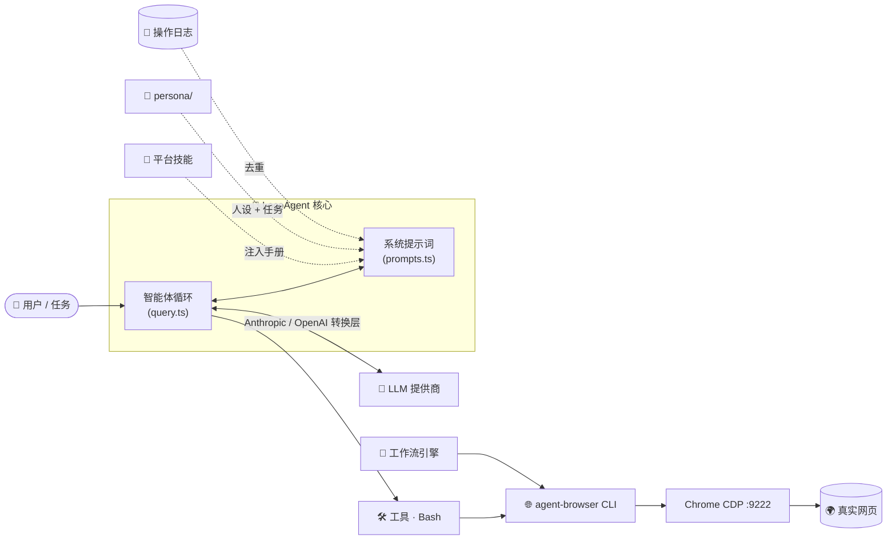

<p align="center">
  
</p>

<p align="center">
  <a href="README.md">English</a> &nbsp;|&nbsp; <b>简体中文</b>
</p>

<p align="center">
  <em>🤖 一个通过<b>真实</b>浏览器自主运营社交媒体的 AI 智能体。</em>
</p>

<p align="center">
  <a href="https://youtu.be/QesPS8xPaDA"></a>
  <a href="#-安装"></a>
  <a href="#-安装"></a>
  <a href="#-模型提供商"></a>
  <a href="#-浏览器自动化"></a>
  
  <a href="LICENSE"></a>
</p>

---

## 📑 目录

- [✨ 什么是 LocoAgent？](#-什么是-locoagent)
- [🏗️ 工作原理](#️-工作原理)
- [🚀 安装](#-安装)
- [⚙️ 配置](#️-配置)
- [🧠 模型提供商](#-模型提供商)
- [🌐 浏览器自动化](#-浏览器自动化)
- [🎯 平台技能](#-平台技能)
- [🌍 多平台目标](#-多平台目标)
- [🔁 工作流引擎](#-工作流引擎)
- [📒 操作日志](#-操作日志)
- [🗓️ 任务调度](#️-任务调度)
- [📡 轨迹监控](#-轨迹监控)
- [🩺 Doctor — 健康检查](#-doctor--健康检查)
- [📁 项目结构](#-项目结构)
- [🧩 技术栈](#-技术栈)
- [🤝 贡献](#-贡献)
- [📄 许可证](#-许可证)

---

## ✨ 什么是 LocoAgent？

**LocoAgent** 是一款 AI 驱动的社交媒体智能体，通过**真实的浏览器自动化**自主运营真实账号。它将 LLM 驱动的智能体循环与 [`agent-browser`](https://github.com/vercel-labs/agent-browser) CLI 结合，在真实网页上完成**感知 → 决策 → 执行**——像真人一样点赞、回复、关注用户、发布内容。

底层上，它是 **Claude Code CLI** 源码树的一个分支，被改造用于社交自动化：经过实战检验的智能体循环、约 40 个工具、约 90 个斜杠命令以及 Ink/React 终端 UI 都被复用，并在其上叠加了一层精简的 LocoAgent 专属逻辑（技能、工作流、人设、操作日志）。

### 🌟 为什么选择 LocoAgent？

| | 特性 | 说明 |
|:--:|------|------|
| 🖥️ | **真实浏览器，真实会话** | 通过 CDP 驱动 Chrome，使用你真实的登录 Cookie——没有脆弱的 API 黑科技，没有 headless 指纹 |
| 🎯 | **平台技能系统** | 加载完整的操作手册（X.com 共 **37** 项操作），让智能体一次性完成复合任务 |
| 🔁 | **工作流引擎** | 确定性、无 LLM 介入的浏览器流水线，由智能体监督——可启动、停止、作为守护进程调度 |
| 📒 | **操作日志** | 跨会话的持久化去重，智能体永不重复点赞、关注或回复 |
| 🧠 | **多提供商 LLM** | 任意 OpenAI 兼容 API——OpenRouter、DeepSeek（思维模式）、OpenAI、Ollama、LM Studio，以及原生 Anthropic / Bedrock / Vertex |
| 🌍 | **多平台并发** | 同时运营 X、LinkedIn、Reddit——每个平台一个隔离 Chrome，同平台串行、跨平台并行 |
| 🖥️ | **跨操作系统** | 通过 host/device 抽象层，一套代码运行于 Windows、macOS 和 Linux |

---

## 🏗️ 工作原理



智能体用 `agent-browser snapshot` **感知**页面，**LLM 决策**下一步动作，**工具执行**（`click`、`fill`、`open`），并在循环继续前**验证**结果——同时优先检查操作日志，确保任何动作都不会被重复执行。

---

## 🚀 安装

### ✅ 前置要求

| 要求 | 版本 | 说明 |
|------|------|------|
| 🥟 [Bun](https://bun.sh) | 最新版 | 运行时**兼**包管理器（仅有 Node 不够） |
| 🟩 Node.js | ≥ 18 | 部分依赖需要 |
| 🌐 [agent-browser](https://github.com/vercel-labs/agent-browser) | 最新版 | 浏览器自动化 CLI |
| 🔵 Google Chrome | 最新版 | 通过 CDP 驱动 |
| 🌿 Git | 任意 | 驱动上下文功能 |

### ⚡ 一键安装（推荐）

一条命令即可安装 Bun + agent-browser、克隆仓库、生成 `.env` 并运行健康检查。在终端中运行时会让你选择 provider（DeepSeek / Anthropic / OpenAI）、输入 API Key，再选择模型（按 Enter 取最新默认；输入 `c` 可自定义模型名）。base URL 按 provider 固定——无需手动输入。

**macOS / Linux / WSL2**
```bash
curl -fsSL https://raw.githubusercontent.com/LocoreMind/locoagent/main/install.sh | bash
```

**Windows（PowerShell）**
```powershell
irm https://raw.githubusercontent.com/LocoreMind/locoagent/main/install.ps1 | iex
```

安装到**当前目录**（空目录直接使用；非空目录则创建 `./locoagent` 子目录；可用 `LOCO_DIR` 覆盖）。安装器会打印确切的目标路径并让你确认。在检出目录内重复运行会就地更新。完成后：`bun run setup-chrome && bun start`。Chrome 与 Git 仅检测、不自动安装——若脚本提示缺失，请自行安装。

### 📥 手动安装步骤

```bash
git clone https://github.com/LocoreMind/locoagent.git
cd locoagent
bun install

# 首次运行前，先检查环境
bun run doctor
```

### ▶️ 运行

```bash
# 交互式 REPL
bun start

# 单次查询（headless / print 模式）
bun start -p "打开 X.com 并点赞第一条关于 AI 智能体的帖子"

# 指定模型
bun start --model anthropic/claude-sonnet-4.5
```

> [!TIP]
> `bun run doctor` 一次性检查 Bun、agent-browser、Chrome 和你的 `.env`。加上 `--check-cdp` 还会探测 CDP 端口。

---

## ⚙️ 配置

在项目根目录创建 `.env` 文件——它会在**启动时自动加载**（通过预加载的 `stubs/globals.ts`）。用四个中立的 `LLM_*` 变量配置提供商即可；它们会在启动时被翻译成对应的内部设置，你无需再纠结各家提供商各自的变量名：

```env
# ── LLM 提供商 —— 任选其一 ────────────────────────────────
LLM_PROVIDER=deepseek        # deepseek | openai | anthropic | custom
LLM_API_KEY=sk-...
LLM_MODEL=deepseek-chat      # 留空 = 使用该提供商默认模型
LLM_BASE_URL=                # 仅 custom / 自建 OpenAI 兼容 API 才需要

# 示例：
#   OpenAI    → LLM_PROVIDER=openai     LLM_MODEL=gpt-5.5
#   Anthropic → LLM_PROVIDER=anthropic  LLM_MODEL=claude-sonnet-4-6
#   Custom    → LLM_PROVIDER=custom     LLM_BASE_URL=http://localhost:1234/v1  LLM_MODEL=...

# ── 智能体行为 ───────────────────────────────────────────
SKIP_PERMISSIONS=1                             # 非交互 / 自动化运行时必需
```

> [!TIP]
> `LLM_*` 是推荐的统一入口。底层会映射到旧的 `CLAUDE_CODE_USE_OPENAI` / `OPENAI_*` /
> `ANTHROPIC_*` 变量——这些变量对老配置仍然有效，且**显式设置的旧变量始终优先**。
> DeepSeek、OpenAI、OpenRouter 及一切 OpenAI 兼容端点在内部共用同一套 `OPENAI_*`
> 命名空间；具体是哪家由 base URL + 模型决定，而非变量名。

> [!NOTE]
> `SKIP_PERMISSIONS=1` 会让 `stubs/globals.ts` 向 argv 注入 `--dangerously-skip-permissions`，使自动化 / headless 运行不会卡在权限确认上。

---

## 🧠 模型提供商

LocoAgent 通过内置的转换层（`src/services/api/openaiShim.ts`）与任意 **OpenAI 兼容 API** 通信，让系统的其余部分与具体提供商解耦。

| 提供商 | Base URL | 说明 |
|--------|----------|------|
| 🔀 **OpenRouter** | `https://openrouter.ai/api/v1` | 一把密钥接入 200+ 模型 |
| 🐳 **DeepSeek** | `https://api.deepseek.com` | 完整支持思维模式（`reasoning_content`） |
| 🟢 **OpenAI** | `https://api.openai.com/v1` | GPT-4o、o 系列等 |
| 🦙 **Ollama** | `http://localhost:11434/v1` | 本地模型 |
| 💻 **LM Studio** | `http://localhost:1234/v1` | 本地模型 |
| 🅰️ **Anthropic** | *(原生 SDK)* | 仅需设置 `ANTHROPIC_API_KEY` |
| ☁️ **AWS Bedrock** | *(原生 SDK)* | AWS 凭证 |
| 🌥️ **Google Vertex AI** | *(原生 SDK)* | GCP 凭证 |

用 `LLM_PROVIDER` + `LLM_BASE_URL` 选择以上任意一家（例如 `LLM_PROVIDER=custom`、`LLM_BASE_URL=https://openrouter.ai/api/v1`）。中立入口会自动映射到转换层；高级用户仍可直接设置 `CLAUDE_CODE_USE_OPENAI=1` 与 `OPENAI_*` 变量。

### 处于 TLS 拦截代理之后（公司 VPN / 校园 FortiGate / Zscaler）

如果请求报 `unable to get local issuer certificate` 或 `untrusted root`，说明你的网络在用自己的 CA 重签 TLS。把该网关的根证书导出为 `.pem` 文件，并在 `.env` 中将 `NODE_EXTRA_CA_CERTS` 指向它——LocoAgent 会在**所有**提供商路径（含 DeepSeek/OpenAI 转换层）上信任它。若该网络直接封锁了提供商域名，请切换网络（如手机热点）或改用未被封锁的提供商。

---

## 🌐 浏览器自动化

LocoAgent 通过 `agent-browser`，使用 CDP（Chrome DevTools Protocol）控制一个**真实的 Chrome 浏览器**。

### 🔒 为什么用 Chrome CDP？

社交平台会检测并封禁 headless 浏览器和 API 自动化。LocoAgent 运行在**真实、完整的 Chrome** 之上——相同的引擎、相同的指纹——因此它的行为与真人无异。它使用一个**独立、隔离、持久的配置文件**（与你日常的 Chrome 完全分开）：你只需登录一次，会话即长期保留，而你平时的浏览不受任何干扰。

### 🛠️ 配置

```bash
# 一次性：以 CDP 启动隔离的 Chrome（Windows / macOS / Linux 命令一致）。
# 它不会杀掉你正常的 Chrome，也不会清除你的会话。
bun run setup-chrome

# 仅首次：在弹出的窗口中登录 X / 你的社交账号——会话会持久保留。
# 重复运行只是重新连接。若要清空隔离配置文件并重新登录：
bun run setup-chrome --reset

# 多平台：启动单个目标，或一次启动全部目标（每个平台一个 Chrome）。
bun run setup-chrome --target linkedin
bun run setup-chrome --all
```

### 👀 感知 → 执行 → 验证 循环

```bash
agent-browser open https://x.com/home     # 🧭 导航
agent-browser snapshot -i                  # 👀 感知 —— 获取带 @ref ID 的可交互元素
agent-browser click @e5                     # 👆 执行 —— 点击点赞按钮
agent-browser fill @e3 "很棒的研究！"        # ⌨️  执行 —— 在回复框输入
agent-browser screenshot result.png        # ✅ 验证 —— 截图确认结果
```

完整的 `agent-browser` CLI 参考被**内嵌在智能体的系统提示词中**，因此它原生掌握每一条命令——技能和工作流只需按名称引用操作，无需重复解释。

---

## 🎯 平台技能

技能是按需通过斜杠命令加载的**操作手册**。加载一个技能会把完整的操作指南注入智能体上下文，使其一次性完成复合任务。

### 📚 可用技能

| 平台 | 命令 | 操作数 | 覆盖范围 |
|------|------|:------:|----------|
| 🐦 **X.com**（Twitter） | `/x-com` | **37** | 浏览 · 互动 · 内容创作 · 社交关系 · 个人主页 · 导航 · 列表 |

### 💬 用法

```bash
# 交互式 —— 加载技能后下达任务
> /x-com 打开主页时间线，给前 3 条关于 AI 的帖子点赞，并回复最好的一条

# headless
bun start -p "/x-com 给 5 条关于「大语言模型」的帖子点赞，然后关注作者"
```

### ➕ 新增一个平台

创建 `skills/<platform>/SKILL.md`，带 YAML frontmatter：

```markdown
---
description: "LinkedIn 平台操作手册"
allowed-tools:
  - Bash
user-invocable: true
---

# LinkedIn Operations

## 1. Navigation
...
## 2. Engagement
...
```

该技能在**启动时自动发现**，并以 `/linkedin` 形式可用。请将每个操作设计为自包含的小节，包含前置条件、agent-browser 命令、验证步骤和已知陷阱（格式范例见 `skills/x-com/SKILL.md`）。

---

## 🌍 多平台目标

**同时**运营多个社交平台——每个平台拥有独立的隔离 Chrome、独立的 CDP 端口、独立的代理。唯一的事实来源是注册表 [`config/browser-targets.json`](config/browser-targets.json)：

```json
{
  "targets": {
    "x":        { "cdpPort": 9222, "proxy": "http://127.0.0.1:6738" },
    "linkedin": { "cdpPort": 9223, "proxy": null },
    "reddit":   { "cdpPort": 9224, "proxy": null }
  }
}
```

`setup-chrome --all/--target`、工作流引擎和 `doctor --check-cdp` 都从它读取——新增一个平台后，所有工具自动识别。

```bash
bun run setup-chrome --all            # 🚀 每个平台一个隔离 Chrome
bun run doctor --check-cdp            # 🩺 探测每个目标的 CDP 端口
```

### 🔀 同平台串行 · 跨平台并行

引擎读取每个工作流的 `"platform"` 字段，并把匹配的目标（`cdpPort`、`profile`、`proxy`、`device`）**注入**到执行器——你永远不必硬编码端口。随后**按平台加文件锁**：同平台运行保持串行（每个配置文件同时只有一个活动标签页），不同平台则并发运行：

```bash
# x + x → 串行；linkedin → 与它们并行。全自动。
bun run workflow orchestrate --ids hf-papers-to-x,x-search-reply,linkedin-search-reply
```

---

## 🔁 工作流引擎

工作流是**确定性的浏览器自动化流水线**，**控制流中不涉及任何 LLM**（LLM 仍可作为单个*步骤*被调用）。智能体充当监督者——它可以查看状态、启动 / 停止运行，而执行本身保持脚本化、可复现。

### 📦 内置工作流

| 工作流 | ID | 调度 | 说明 |
|--------|----|:----:|------|
| 📰 **HuggingFace 每日论文** | `hf-daily-papers` | `daily` | 抓取热门论文——标题、摘要、缩略图——并保存到本地数据文件 |
| 🐦 **HF 论文 → X.com** | `hf-papers-to-x` | `daily` | 完整流水线：抓取 HF 论文 → 下载缩略图 → 逐条发为图文推文 |
| 🔍 **X.com 搜索 & AI 回复** | `x-search-reply` | `hourly` | 在 X.com *Latest* 搜索 → 读取每条帖子 → 用 LLM 生成回复 → 发布回复 |
| 💼 **LinkedIn 搜索 & AI 评论** | `linkedin-search-reply` | `hourly` | 在 LinkedIn *Latest* 搜索 → 读取每条帖子 → 用 LLM 生成评论 → 发布评论 |

### 🖥️ CLI

```bash
bun run workflow list                          # 📋 列出所有工作流 + 状态
bun run workflow run    --id hf-papers-to-x    # ▶️  运行一次（阻塞）
bun run workflow start  --id hf-papers-to-x    # 🚀 运行一次（后台）
bun run workflow daemon --id x-search-reply --interval 3   # 🔄 每 3 分钟运行一次
bun run workflow orchestrate --ids a,b,c       # 🌍 多平台：同平台串行、跨平台并行
bun run workflow stop   --id x-search-reply    # 🛑 在下一个检查点停止
bun run workflow reset  --id x-search-reply    # ♻️  清除已停止状态 → 空闲
bun run workflow status                        # 📊 所有工作流状态
bun run workflow history --id hf-papers-to-x   # 🕘 执行历史
```

### 🧱 创建自定义工作流

**第 1 步 —— 定义** (`workflows/<id>.json`)：

```json
{
  "id": "my-workflow",
  "name": "My Custom Workflow",
  "description": "这个工作流做什么",
  "schedule": "daily",
  "platform": "x",
  "executor": "executors/my-workflow.ts",
  "config": { "searchQuery": "ai agent", "maxPosts": 5 }
}
```

> [!TIP]
> 设置 `"platform"`（如 `x` / `linkedin` / `reddit`）——切勿硬编码 `cdpPort`。引擎会在运行时从 [`config/browser-targets.json`](config/browser-targets.json) 把该目标的 `cdpPort`、`profile`、`proxy`、`device` 注入到 `config`，并为本次运行锁定该平台。

**第 2 步 —— 执行器** (`workflows/executors/my-workflow.ts`)：

```typescript
#!/usr/bin/env bun
import { execSync } from 'node:child_process'

const configArg = process.argv.find((_, i, a) => a[i - 1] === '--config')
const config = JSON.parse(configArg!)

function ab(cmd: string): string {
  return execSync(`agent-browser --cdp ${config.cdpPort} ${cmd}`, {
    encoding: 'utf-8', timeout: 30000,
  }).trim()
}

console.error('[my-workflow] Step 1: ...')        // 📝 日志 → stderr
// ... 用 ab() 编写你的自动化逻辑 ...

console.log(JSON.stringify({ stepsCompleted: 1, stepsTotal: 1 }))   // 📤 摘要 → stdout 最后一行
```

**第 3 步 —— 测试：**

```bash
bun run workflow run --id my-workflow
```

> [!IMPORTANT]
> **执行器契约：** 接受 `--config <json>`，日志写入 **stderr**，并把单个 JSON 对象（`{stepsCompleted, stepsTotal}`）作为 **stdout 的最后一行**输出。缺失或格式错误会使该次运行标记为失败。

📖 完整指南：[`docs/workflow-development-guide.md`](docs/workflow-development-guide.md)——涵盖去重、检查点 / 停止协议、LLM 集成和守护进程模式。

---

## 📒 操作日志

跨会话的持久化记忆。智能体在**行动前检查日志**、在**行动后记录每个动作**——避免重复点赞、关注和回复。这个去重契约是智能体身份的核心。

```bash
# 🔍 行动前检查（exit 0 = 已完成 → 跳过；exit 1 = 未完成 → 继续）
bun run scripts/log-operation.ts check \
  --platform x --action like --url "https://x.com/.../status/123"

# ✅ 动作成功后记录
bun run scripts/log-operation.ts add \
  --platform x --action like --url "https://x.com/.../status/123" \
  --status success --note "AI 智能体研究帖"

# 🕘 查看最近的操作
bun run scripts/log-operation.ts recent --limit 20

# 📊 30 天摘要（启动时自动注入系统提示词）
bun run scripts/log-operation.ts summary --days 30
```

状态保存在 `persona/operation-log.json`（人类可读的 JSON）。30 天摘要会被注入每个会话的系统提示词，让智能体始终了解自己最近的历史。

---

## 🗓️ 任务调度

用结构化的每日 / 每周任务执行取代临时 prompt。

### 📝 定义任务 —— `persona/tasks.md`

```markdown
## Daily Tasks
1. 与相关内容互动（给匹配主题查询的帖子点赞）
2. 监控自己项目的提及
3. 在最相关的帖子下留 1 条技术评论

## Weekly Tasks (Monday)
4. 关注 3-5 位相关研究者
5. 发布 1 条关于近期研究发现的原创推文

## Session Constraints
| 动作   | 每次会话上限 |
|--------|:-----------:|
| 点赞   | 10          |
| 评论   | 2           |
| 关注   | 5           |
| 发帖   | 1           |
```

### ▶️ 运行

```bash
bun run run-tasks                   # 执行今天的任务
bun run run-tasks:dry               # 预览生成的 prompt（不实际运行）
bun run run-tasks -- --platform x   # 限定单个平台
```

> [!NOTE]
> `persona/` 已被 gitignore，全新克隆中不存在。智能体没有它也能正常运行——只是提示词中缺少人设、任务和操作历史的上下文。

---

## 📡 轨迹监控

`--print` 模式是个黑盒。轨迹监控会监视会话日志并打印**实时执行状态**。

```bash
# 终端 1 —— 启动监控
bun run tail

# 终端 2 —— 运行智能体
bun start -p "/x-com 打开时间线，给第一条帖子点赞"
```

```text
═══ New Task ═══
/x-com 打开时间线，给第一条帖子点赞

[6:30:47 PM] ⚡ Bash: agent-browser connect 9222
[6:30:47 PM] ✓ Result: Done
[6:31:10 PM] ⚡ Bash: agent-browser open https://x.com/home
[6:31:27 PM] ⚡ Bash: agent-browser snapshot -i -c -s 'article'
[6:31:44 PM] ● Agent: Found first post, like button ref=e136
[6:31:44 PM] ⚡ Bash: agent-browser click e136
[6:31:45 PM] ✓ Result: Done
```

```bash
bun run tail:history     # 🔁 从头回放最新会话
bun run tail:list        # 📋 列出最近的会话
bun run tail <id>        # 🎯 监控指定会话
```

---

## 🩺 Doctor — 健康检查

跨平台的预检工具与上手助手。首次运行前、或感觉哪里不对时执行它。

```bash
bun run doctor               # 检查 Bun、agent-browser、Chrome、.env
bun run doctor --check-cdp   # …同时探测每个平台目标的 CDP 端口
```

它会检测你的宿主操作系统（Windows / macOS / Linux），解析 Chrome 可执行文件路径，探测 `config/browser-targets.json` 中的每个目标，并报告任何缺失或配置错误。

---

## 📁 项目结构

```text
locoagent/
├── src/                          # ⬆️ 内置的 Claude Code CLI 源码 —— 视作依赖对待
│   ├── entrypoints/cli.tsx       #    CLI 入口
│   ├── services/api/             #    多提供商 LLM 转换层（openaiShim / codexShim）
│   ├── services/mcp/             #    MCP 服务器管理
│   ├── tools/                    #    约 40 个工具实现
│   ├── commands/                 #    约 90 个斜杠命令
│   ├── components/ · hooks/      #    Ink/React 终端 UI
│   ├── query.ts                  #    智能体循环引擎
│   └── constants/prompts.ts      #    🔌 接缝 —— 将 LocoAgent 状态注入提示词
├── scripts/                      # 🧩 LocoAgent 专属工具
│   ├── setup-chrome.ts           #    Chrome + CDP 启动器（跨平台）
│   ├── doctor.ts                 #    健康检查 / 上手
│   ├── log-operation.ts          #    操作日志 CLI（去重）
│   ├── run-tasks.ts              #    任务调度器
│   ├── tail-agent.ts             #    实时轨迹监控
│   ├── workflow-engine.ts        #    工作流生命周期管理
│   └── lib/                      #    平台层 —— host · device · config · 目标锁
├── config/
│   └── browser-targets.json      # 🌍 每平台目标注册表（cdpPort · proxy · profile）
├── skills/<platform>/SKILL.md    # 🎯 平台操作手册（→ /<platform>）
├── workflows/
│   ├── <id>.json                 #    工作流定义
│   ├── executors/<id>.ts         #    脚本化流水线
│   └── state.json                #    运行时状态（gitignore）
├── persona/                      # 🪪 人设、任务、操作日志（gitignore）
├── docs/                         # 📖 公开文档（工作流指南、跨平台指南）
├── stubs/                        #    预加载全局变量 + 本地包桩
├── .env                          #    本地配置（自动加载）
└── package.json
```

> [!TIP]
> **LocoAgent 这一层很小，且位于 `src/` 之外。** 接缝是 `src/constants/prompts.ts`，它会 shell out 把人设、任务、操作日志摘要和工作流状态注入每个会话的系统提示词。

---

## 🧩 技术栈

| | 组件 | 技术 |
|:--:|------|------|
| 🥟 | 运行时 | **Bun**（不支持 Node） |
| 🟦 | 语言 | TypeScript (TSX) |
| ⚛️ | UI | React + [Ink](https://github.com/vadimdemedes/ink) 终端渲染器 |
| ⌨️ | CLI | Commander.js |
| 🌐 | 浏览器自动化 | agent-browser + Chrome CDP |
| 🧠 | LLM 集成 | Anthropic SDK + OpenAI 兼容转换层 |
| 🔌 | 扩展协议 | MCP（Model Context Protocol） |

---

## 🤝 贡献

欢迎贡献！高价值方向：

- 🎯 **新平台技能** —— LinkedIn、Reddit、Instagram 操作手册
- 🔁 **新工作流** —— 自动化内容流水线（[开发指南](docs/workflow-development-guide.md)）
- 🛠️ **新工具** —— 扩展智能体能力
- 🐛 **Bug 修复** —— 尤其是浏览器自动化的边角情形

分支 → 改动 → `bun run typecheck` → 提交（`feat:` / `fix:` / `docs:`）→ 提 PR，写清 **What / Why / How / Testing**。完整指南见 [CONTRIBUTING.md](CONTRIBUTING.md)。

> [!NOTE]
> 项目没有单元测试套件。请用 `bun run typecheck` 和真实的 `bun start -p "..."` 运行来验证。`bun test scripts` 会运行平台层的单元测试。

---

## 📄 许可证

[MIT](LICENSE) © [LocoreMind](https://github.com/LocoreMind)

<p align="center">
  <sub>由 LocoreMind 用 🤖 打造 · <a href="README.md">English</a></sub>
</p>
